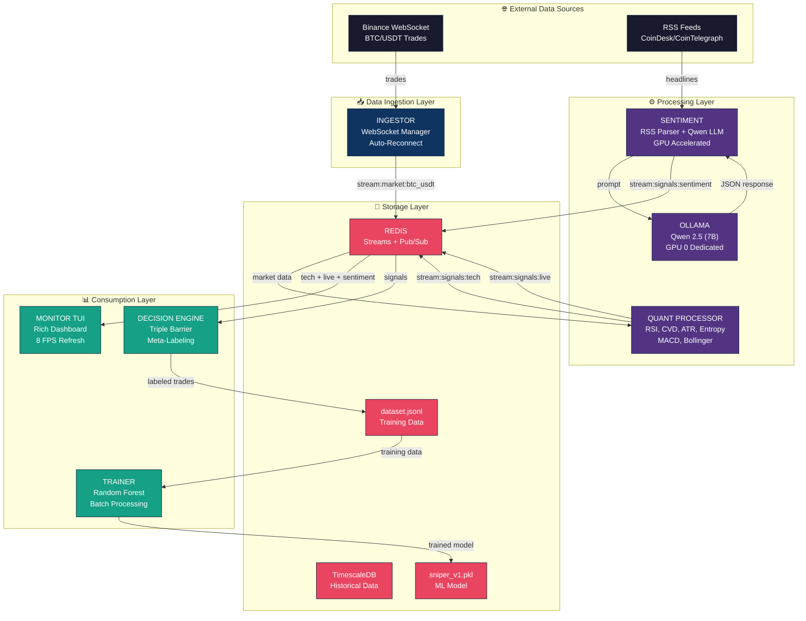

# 🏗️ VOSTOK-1 Architecture Overview

> **Hybrid Trading System: Algorithmic + Generative AI**

## System Philosophy

VOSTOK-1 is a **Hybrid High-Frequency Trading (HFT) System** that combines:
- 🤖 **Algorithmic Analysis**: Real-time technical indicators (RSI, CVD, ATR, Entropy)
- 🧠 **Generative AI**: Sentiment analysis via local LLM (Qwen 2.5)
- 📊 **Machine Learning**: Meta-labeling with Random Forest (training pipeline)

---

## High-Level Architecture



---

## Data Streams (Redis)

| Stream | Producer | Consumer(s) | Content |
|--------|----------|-------------|---------|
| `stream:market:btc_usdt` | Ingestor | Quant | Raw trades (price, volume, side) |
| `stream:signals:tech` | Quant | Monitor, Decision | Full candle + indicators |
| `stream:signals:live` | Quant | Monitor | Real-time price/CVD pulse |
| `stream:signals:sentiment` | Sentiment | Monitor, Decision | AI sentiment score |

---

## Container Topology

```
┌─────────────────────────────────────────────────────────────┐
│                     VOSTOK-1 CLUSTER                        │
├─────────────────────────────────────────────────────────────┤
│                                                             │
│  ┌─────────┐  ┌─────────┐  ┌─────────┐  ┌─────────┐        │
│  │  REDIS  │  │TIMESCALE│  │ OLLAMA  │  │INGESTOR │        │
│  │  :6379  │  │  :5432  │  │ :11434  │  │ WS/REST │        │
│  └────┬────┘  └────┬────┘  └────┬────┘  └────┬────┘        │
│       │            │            │            │              │
│       └────────────┼────────────┼────────────┘              │
│                    │            │                           │
│  ┌─────────┐  ┌────┴────┐  ┌───┴─────┐  ┌─────────┐        │
│  │  QUANT  │  │DECISION │  │SENTIMENT│  │ MONITOR │        │
│  │Processor│  │ Engine  │  │  (LLM)  │  │  (TUI)  │        │
│  └─────────┘  └─────────┘  └─────────┘  └─────────┘        │
│                                                             │
│  ┌─────────┐                                               │
│  │ TRAINER │  (Batch Job - On Demand)                      │
│  │  (ML)   │                                               │
│  └─────────┘                                               │
│                                                             │
└─────────────────────────────────────────────────────────────┘
```

---

## Technology Stack

| Component | Technology | Purpose |
|-----------|------------|---------|
| **Language** | Python 3.11 | Core services |
| **Message Bus** | Redis Streams | Real-time event streaming |
| **Database** | TimescaleDB | Time-series historical data |
| **LLM** | Ollama + Qwen 2.5 (7B) | Local sentiment analysis |
| **ML** | scikit-learn (Random Forest) | Meta-labeling |
| **TUI** | Rich | Terminal dashboard |
| **Container** | Docker + Compose | Orchestration |

---

## Network Configuration

- **Network**: `vostok_net` (bridge mode)
- **Internal DNS**: Containers communicate via service names
- **Exposed Ports**:
  - Redis: 6379
  - TimescaleDB: 5432
  - Ollama API: 11434

---

## GPU Allocation

| GPU | Device ID | Allocation |
|-----|-----------|------------|
| Quadro P2000 | `0` | Ollama/Qwen (Dedicated) |
| Quadro P2000 | `1` | Desktop/Windows |

---

## Next Steps

- [02_modules_deep_dive.md](./02_modules_deep_dive.md) - Component Details
- [03_strategy_logic.md](./03_strategy_logic.md) - Trading Strategy
- [04_operations_manual.md](./04_operations_manual.md) - Operations Guide
