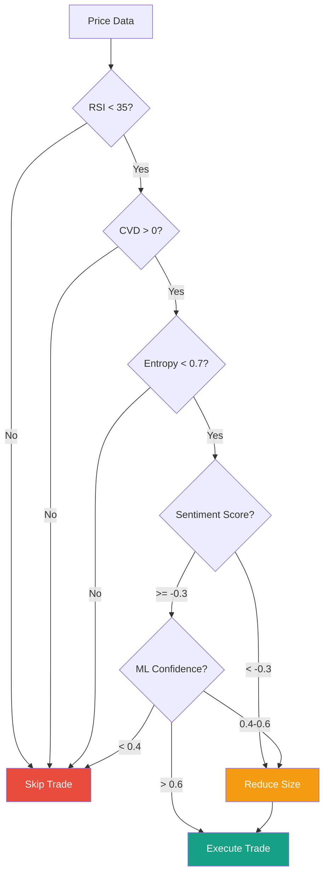

# 🧠 Strategy Logic

> **The Financial Brain of VOSTOK-1**  
> **Versão:** 2.0 | **Última Atualização:** 2025-12-22

---

## Trading Philosophy

VOSTOK-1 implements a **Contrarian Mean-Reversion Strategy** enhanced with:

- 📊 Technical divergence detection
- 🧠 AI-powered sentiment filtering
- 🎓 ML-based signal validation (future)

---

## Current Trigger: RSI + CVD Divergence

### The Core Hypothesis

> When price is oversold (RSI < 35) but buying pressure exists (CVD > 0),
> the market is likely to reverse upward.

```
Price Action:    ──────╲___________╱──────
                              ↑
                       Hidden Buying

RSI:             ──────────[32]──────────
                        OVERSOLD

CVD:             ──────────[+0.45]───────
                        ACCUMULATION
                              ↓
                    🎯 SNIPER TRIGGER
```

### Trigger Conditions

| Metric | Condition | Rationale |
|--------|-----------|-----------|
| **RSI** | < 35 | Oversold territory |
| **CVD** | > 0 | Net buying pressure |
| **Entropy** | < 0.7 | Low market noise |
| **ATR** | > min | Sufficient volatility |

---

## Risk Management

### Triple Barrier Parameters

```python
# ATR-based Dynamic Barriers
TAKE_PROFIT = 2.0 * ATR   # Dynamic TP
STOP_LOSS = 1.0 * ATR     # Dynamic SL (Risk:Reward = 1:2)
TIME_LIMIT = 45min        # Max hold time
```

### Position Sizing (Future)

```
Risk per Trade = 1% of Capital
Position Size = Risk / (Entry - Stop Loss)
```

---

## Filters

### 1. Entropy Filter (Market Regime)

| Entropy | Regime | Action |
|---------|--------|--------|
| < 0.3 | Trending | ✅ Trade |
| 0.3 - 0.7 | Normal | ✅ Trade with caution |
| > 0.7 | Chaos | ⛔ Avoid |

### 2. ATR Filter (Volatility)

- **Low ATR**: Skip (not enough movement for profit)
- **Normal ATR**: Trade with standard stops
- **High ATR**: Widen stops, reduce size

### 3. Funding Rate Filter

| Funding | Market Bias | Signal Adjustment |
|---------|-------------|-------------------|
| > +0.05% | Overleveraged longs | Bearish bias |
| -0.05% to +0.05% | Neutral | No adjustment |
| < -0.05% | Overleveraged shorts | Bullish bias |

---

## The Role of AI

### 🤖 LLM Sentiment Analysis (Active)

The Qwen 2.5 model analyzes news headlines and provides:

```json
{
    "sentiment_score": 0.45,
    "summary": "Institutional inflows positive, regulatory clarity improving",
    "confidence": 0.85
}
```

**Integration with Trading:**

| Sentiment | Technical Signal | Final Action |
|-----------|------------------|--------------|
| Bullish (+0.3 to +1.0) | Bullish | ✅ Strong Buy |
| Bullish | Bearish | ⚠️ Hold |
| Neutral (-0.2 to +0.2) | Any | Use technical only |
| Bearish (-1.0 to -0.3) | Bullish | ⚠️ Reduce size |
| Bearish | Bearish | ⛔ Strong Sell |

### 🎓 ML Model (Training Pipeline)

The Random Forest model learns from historical trade outcomes:

```
Input Features:          Output:
─────────────────        ───────
RSI                      Label (0 or 1)
CVD                      ↓
Entropy                  Probability of
Volatility ATR           Successful Trade
Funding Rate
```

**Future Integration:**

```python
# Before executing a trade
ml_probability = model.predict_proba(features)

if ml_probability > 0.6:
    execute_trade()
elif ml_probability > 0.4:
    reduce_position_size()
else:
    skip_trade()
```

---

## Signal Flow



---

## Backtesting Results (Sample)

| Metric | Value |
|--------|-------|
| Win Rate | 34.57% (Paper) |
| Precision | 35.95% |
| Recall | 53.77% |
| Risk/Reward | 1:2 |
| Expected Value | +7.85%/trade |
| Drawdown (Paper) | -0.33% |

> ⚠️ **Note**: These are simulated results. Past performance does not guarantee future results.

---

## Future Enhancements

1. **Multi-Timeframe Confirmation**: Align 1m, 5m, 15m signals
2. **Order Flow Analysis**: Integrate Coinglass liquidation data
3. **Adaptive Parameters**: Self-tuning RSI thresholds based on volatility
4. **Portfolio Mode**: Trade multiple pairs with correlation filtering

---

## Next Steps

- [04_operations_manual.md](./04_operations_manual.md) - Operations Guide
